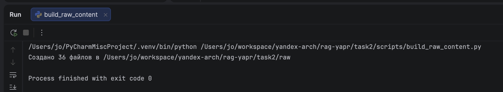

# Задание 2. База знаний для RAG-бота

Корпус из 36 markdown-документов о вымышленной вселенной **Veylarian Chronicles**, полученный методом подмены ключевых терминов на основе общеизвестного фандома. Это нужно, чтобы LLM не могла «угадать» ответы по своей внутренней памяти и реально пользовалась только тем, что лежит в векторной базе через RAG.

**Логика приёма:**
- LLM в обучении видела всю Википедию и популярные фандомы → на вопрос «кто такой X» отвечает по памяти, даже без контекста.
- После замены всех ключевых терминов на вымышленные («X» → «Y») модель про «Y» не знает ничего.
- Если бот отвечает — работает retrieval + генерация. Если пишет «не знаю» — retrieval не нашёл нужный чанк (или его нет в базе). Всё диагностируется однозначно.

## Структура проекта

```
task2/
├── README.md                       # этот файл
├── terms_map.json                  # словарь замен (≈150 пар), разбит по категориям
├── scripts/
│   ├── build_raw_content.py        # генерирует raw/ из встроенного датасета
│   ├── substitute.py               # применяет terms_map.json к raw/ → knowledge_base/
│   └── scrape.py                   # опциональный референс: как тянуть из вики через requests
├── raw/                            # 36 исходных .md с оригинальными терминами (для аудита)
└── knowledge_base/                 # 36 финальных .md в вселенной Veylarian Chronicles ← это деливерабл
```

## Как воспроизвести

```bash
cd task2
python scripts/build_raw_content.py    # 1. наполняет raw/ (36 файлов)
python scripts/substitute.py            # 2. применяет замены → knowledge_base/
```

После запуска в `knowledge_base/` будут 36 файлов вида `kael_venarix.md`, `void_core.md`, `the_synth_flux.md` и т.д.

## Как устроены замены

`terms_map.json` разбит на 6 категорий: `characters`, `planets`, `ships_and_tech`, `factions_and_orders`, `concepts`, `events`. Это удобно для чтения и расширения, но движок подстановки разворачивает всё в плоский dict.

**Принципы дизайна:**
1. **Сохранены родственные и сюжетные связи.** Anakin Skywalker → Ankarin Venarix, Luke Skywalker → Kael Venarix — фамилия одна, потому что они отец и сын. Если сломать эту связность, бот будет противоречить сам себе и ты подумаешь, что RAG сломан, хотя сломан словарь.
2. **Узнаваемая эстетика по типу сущности.** Планеты оканчиваются на `-is/-ia/-an/-al`, технологии — компаунды через дефис (`plasma-blade`, `warp coil`), фракции — тематические имена (`Iron Dominion`, `Free Coalition`).
3. **Одиночные имена и прилагательные тоже в словаре.** Не только «Luke Skywalker», но и «Luke». Не только «Galactic Empire», но и «Imperial» как прилагательное. Это критично — без этого утечки полезут в каждом втором тексте.

## Как работает `substitute.py`

Три ключевых решения:

1. **Сборка одного большого regex с альтернативами**, отсортированными по длине ключа от длинной к короткой. Так «Darth Vader» матчится раньше одиночного «Vader», и не будет двойной замены.
2. **Границы слов `\b` в regex**. «Force» не сработает внутри «enforce». «Han» не сработает внутри «Chandrila».
3. **Имя выходного файла берётся из H1 уже подставленного текста.** Если бы оставили исходное имя `luke_skywalker.md`, по нему можно было бы «угадать» исходный термин — это дыра в чистоте эксперимента. Теперь файл называется `kael_venarix.md`.

## Аудит чистоты

После каждого изменения словаря прогоняется проверка вида:

```python
import re
from pathlib import Path

originals = ["Luke", "Vader", "Leia", "Jedi", "Force", "Empire", ...]
for f in Path("knowledge_base").glob("*.md"):
    text = f.read_text()
    for term in originals:
        if re.search(r"\b" + re.escape(term) + r"\b", text):
            print(f"{f.name}: leak '{term}'")
```

Текущая версия проходит без утечек.

## Цифры



- **36** документов
- **~150** пар замен
- **~800** реальных подстановок при прогоне
- **0** утечек оригинальных терминов в финальном корпусе
