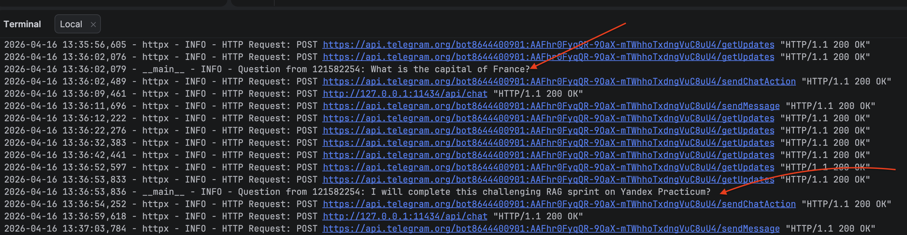

# Задание 4. Реализация RAG-бота с техниками промптинга

## Архитектура пайплайна


User Question → Telegram/Console → BGE-M3 (embeddings) → FAISS Index (72 chunks) 
→ Prompt (System + Few-shot + CoT + Context + Question) → OpenAI LLM (gpt-4o-mini) → Answer + Sources

## Техники промптинга

### Few-shot prompting

В system-промпт встроены 2 примера из базы знаний:
1. Вопрос о месте рождения Kael Venarix → ответ с цитированием kael_venarix.md
2. Вопрос о Synth Flux → ответ с цитированием the_synth_flux.md

Примеры реальные — извлечены из базы знаний, не придуманы. Они задают модели формат ответа: шаги рассуждения + финальный ответ + источник.

### Chain-of-Thought (CoT)

System-промпт содержит явную инструкцию:
> Think step-by-step before answering:
> 1. Identify which context fragments are relevant
> 2. Extract the key facts
> 3. Formulate a clear answer

Модель выводит шаги рассуждения перед финальным ответом.

### Отказ при отсутствии информации

Промпт содержит правило:
> If the context does NOT contain enough information, say: "I don't have enough information in my knowledge base to answer this question."

Это критично для RAG: модель не должна галлюцинировать, если retriever не нашёл релевантных чанков.

## Интерфейсы

### Telegram-бот (основной, тариф Про)

```bash
export GOOGLE_API_KEY=...          # или OPENAI_API_KEY=sk-...
export TELEGRAM_BOT_TOKEN=123456:ABC-...
python task4/telegram_bot.py
```

Создание бота:
1. Открыть @BotFather в Telegram
2. `/newbot` → задать имя и username
3. Скопировать токен в `TELEGRAM_BOT_TOKEN`

### Консольный REPL (запасной)

```bash
export GOOGLE_API_KEY=...   # или OPENAI_API_KEY=sk-...
cd task4
python console_bot.py
```

## Структура модуля

```
task4/
├── task4_README.md     # этот файл
├── rag_chain.py        # ядро RAG: retriever + prompt + LLM chain
├── telegram_bot.py     # Telegram-интерфейс
└── console_bot.py      # консольный REPL
```

## Ключевые решения

| Решение | Выбор | Почему |
|---|---|---|
| LLM | Google Gemini 2.0 Flash (бесплатно) / OpenAI gpt-4o-mini (платно). Настраиваемо через `RAG_LLM_MODEL` | Gemini — бесплатный tier, достаточно для RAG |
| Retriever top-k | 4 | Баланс между полнотой контекста и стоимостью токенов |
| Temperature | 0.1 | Минимум «творчества» — нужны точные ответы по контексту |
| Framework | LangChain LCEL | Прозрачная цепочка: retriever → format → prompt → llm → parse |

## Переменные окружения

| Переменная | Обязательна | Описание |
|---|---|---|
| `GOOGLE_API_KEY` | Одна из двух | API-ключ Google AI (Gemini). Бесплатно |
| `OPENAI_API_KEY` | Одна из двух | API-ключ OpenAI. Платно |
| `TELEGRAM_BOT_TOKEN` | Для Telegram | Токен от @BotFather |
| `RAG_LLM_MODEL` | Нет | Модель LLM (по умолчанию `gemini-2.0-flash` / `gpt-4o-mini`) |


Не удалось победить с внешней LLM  из-за региональной принадлежности, запустил на локальной Ollama:



